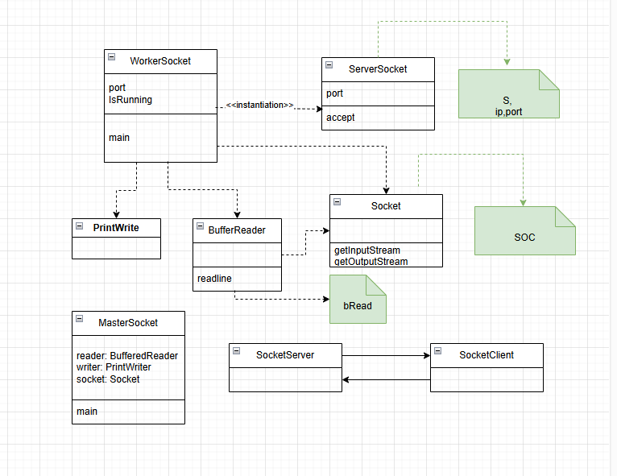

# Programmation Parallèle à mémoire partagée 

## TP1 : Conception / Thread 

Ce TP fait référence au package nommé "tp1" crée dans l'arborescence du projet.
Dans cette partie le but était de simuler un mouvement d'un 
ou plusieurs "mobiles" en java grâce aux différents concepts évoqués dans le cours de M.Dufaud 
Cette partie du TP inclue les classes "TpMobile","UneFenetre" et "UnMobile".

### Exercice 1 :

1) Pour cet exercice on a dû écrire la classe UneFenetre qui dérive de JFrame, possèdant un champs "UnMobile sonMobile"
. Le constructeur de cette classe doit pouvoir ajouter le champ à la fenêtre, créer un thread, afficher la fenêtre et lancer le thread.

En effet, en java, JFrame et JPannel sont des classes du langage de programmation Java. Elles ressemblent à des fenêtres lorsqu’elles sont « exécutées » (JFrame est la principale fenetre et les JPannel sont les zones à l'intérieur de la JFrame).

C'est pourquoi le classe UneFenetre hérite de JFrame : 

et la classe UnMobile hérite de JPannel : 

Ainsi, les propriété de la JFrame sont utilisés pour coder la classe UneFenetre et créer une interface graphique : 

Tout d'abord un container de contenu de la fenetre où tous les composants sont ajoutés est crée, 
pour le quel on crée un Mobile avec largeur et hauteur. Le mobile est ensuite ajouté au container et au Thread nouvellement crée.
Il nous reste plus qu'à démarrer le Thread et le rendre visible graphiquement.

Il faut savoir qu'un Thread est une unité d'exécution faisant partie d'un programme et qui fonctionne parrallèlement aux autres unités et de manière totalement autonome.
Ainsi, chaque thread a son propre environnement d’éxécution et sa pile et est unique car est caractérisé par son environnement, état(actif,en attente...) et son nom.

Cependant, "Runnable" est une interface qui permet en quelque sortes de définir des tâches exécutables par ces mêmes threads.

2. Ensuite le but de l'exercice était de faire repartir le mobile dans le sens inverse une fois qu'il touche le bord de la fenetre.

Pour s'y faire il fallait modifier le methode run() utilisée pour le comportement du thread de la classe Mobile en ajoutant une boucle : 

Ainsi, la méthode run() étant une méthode de l'interface runnable, elle sera appelé lorsque le thread démarre.
Parallèlement, la méthode repaint() sera appelée à chaque itération de la boucle for, elle servira à communiquer avec le composant graphique et lui dire de se redessiner. Elle va donc mettre à jour l'affichage du mobile ( appel indirect de paintComponent() ).
Thread.sleep() dans ce contexte sert uniquement à introduire un délai entre chaque repaint d'un thread ce qui crée le mouvement graphiquement.

### Exercice 2 : 

Cet exercice consitais à ajouter un bouton à la dernière fenêtre de l'exercice I (mais a été négligé sous la demande de M.Dufaud). Ce bouton devait arrêter ou relancer le mobile en utilisant 
les méthodes suspend() et resume() de la classe Thread.

Les méthodes suspend() et resume() sont utilisées pour contrôler l'exécution d'un thread. De ce fait comme les noms l'indiquent
la méthode suspend() arrête temporairement le thread en le mettant en pause (un des états possibles d'un thread), d'un autre côté la méthode resume() est employé pour reprendre l'éxécution d'un thread qui est actuellement sous la méthode suspend() et donc en attente.

### Exercice 3 :

Le but de l'exercice 3 était de modifier le code de l'exercice II de façon à afficher 2 mobiles,pour chaque bouton et chaque zone
d'affichage sont disposés sur une grille de 2 lignes et 2 colonnes.

Ainsi, l'exercice 3 a été codé de cette manière en modifiant la classe UneFenetre: 

On introduit simplement une boucle imbriquée pour symboliser les lignes et les colonnes de notre future fenetre, puis pour chaque ligne et colonne on crée un mobile et le thread pour ce mobile en les mettant en marche.

### Exercice 4 (Bonus après le TP2):

1) Implementation des semaphores pour les mobiles de la manière :
-on a plusieurs mobiles et plusieurs colonnes 
-quand les mobiles arrivent au bout de la colonnes ils sont stoppé et dans le wait
-un seul d'eux peut passer à la fois
et pareil pour le retour.

2) Ensuite, il faut implémenter un systeme qui genere un nombre random pour le pas du mobile (sonPas),
pour ensuite avoir un liste de mobiles avec des vitesses différentes.

## TP2 : Affichage / Semaphores

#### Exercice 1 : 

-Un seul semaphore pour tout les affichages 
-Il faut identifier la section critique (par exemple une boucle)
-Enfin introduire les syncWait et syncSignal autour de la section critique
