# Programmation Parallèle à mémoire partagée 

## Introduction 

>Le travail effectué sera présenté sour forme d'explication des concepts et explication du travail réalisé durant les TP de la programmation avancée.
Les travaux ont été réalisés sur IntelliJ, qui est un IDE (environnement de développement intégré) de JetBrains. 
C'est un outil qui nous a permi de gérer efficacement les exercices demandés.
Parrallèlement, le GIT a été utilisée pour ce travail, pour permettre un meilleur suivi d'avancement des exercices.
Enfin, on a utilisé StarUML pour la partie conception de ce travail, c'est à dire la réalisation des diagrammes (et même possibilité de générer le code).

## TP0 : Programmation répartie 

>Le travail de la toute première séance de cours consitait à analyser la composition hardware des pc qui se trouvent dans nos salles de tp, distinguer les architectures et les comparer entre-elles et aussi avec par exemple nous téléphones.
Pour cela certains concepts nous ont été introduit par M.Dufaud, comme notamment un "paradigme", "framework", "transparence", "interopérabilité", et "terminologie".

_Définitions des termes :_
* _Un paradigme est une approche particulière (dans notre cas algorithmique) constitué de principes et méthodes qui nous permet de résoudre un problème._
* _Un framework est un ensemble d'outils et bibliothèques quon utilisera pour développer un logiciel._
* _Transparence est le fais de percevoir une interface d'une facon qui nous fais penser qu'elle agit naturellement._
* _Interopérabilité est la capacité des systèmes ou programmes à agir ensemble._
* _Terminologie est un ensemble des notions qu'on utilise dans un domaine donné._

>D'après les recherches sur les pc de la salle de tp, on trouve une première architecture de machines : 

Le type de processeur et sa vitesse en GHz:

- Processeur Intel(R) Core(TM) i7-7700 CPU @ 3.60GHz
- Vitesse : 3,60 GHz
- Cœurs :	4
- Processeurs logiques :	8

La quantité de mémoire RAM :

- Mémoire : 32,0 Go RAM
- Vitesse :	2400 MHz

Disque 0 (C:) : 

- SanDisk X400 2.5 7MM 512GB SSD

GPU :

- Intel(R) HD Graphics 630
- Mémoire du GPU dédiée    
- Mémoire du GPU partagée et proc graphique :  15,9 Go

OS :
- Édition	Windows 11 Professionnel Éducation / 64 bits / x64

Marque : 
- Dell 

>En effet quelques personnes dans la salle avaient des architectures différentes mais sans d'énormes changements à part le processeur qui est un peu plus récent et puissant.
Cependant en comparant avec l'architecture de nos téléphones : 

- ColorOS 13.1 | Android 13
- Nom : OPPO Find X3 Lite 5G
- Stockage : 128 Go
- Modèle : CPH2145
- Processeur : QUalcomm SDM765G  5G Octo-coeur
- Taille écran : 6,43 po
- RAM ! 8 GO + 6 GO
- Appareil photo AVANT 32 MP
- Arrière 64 MP+8MP+2MP+2MP

>On se rend compte que par exemple le processeur du téléphone est de nos jours assez puissant tandis qu'à l'époque, l'équivalent serait utilisé dans la recherche et pour les calculs. De même s'applique au processeur du pc et aussi les autres composant du système.

## TP1 : Conception / Thread 

>Ce TP fait référence au package nommé "tp1" crée dans l'arborescence du projet.
Dans cette partie le but était de simuler un mouvement d'un 
ou plusieurs "mobiles" en java grâce aux différents concepts évoqués dans le cours de M.Dufaud 
Cette partie du TP inclue les classes "TpMobile","UneFenetre" et "UnMobile".

### Exercice 1 :

>1) On commence l'exercice en créant une conception avec StarUML, disponible dans le dossier conception (/ostap.prog.avancee/uml). 
Ensuite, pour cet exercice on a dû écrire la classe UneFenetre qui dérive de JFrame, possèdant un champs "UnMobile sonMobile"
. Le constructeur de cette classe doit pouvoir ajouter le champ à la fenêtre, créer un thread, afficher la fenêtre et lancer le thread.

>En effet, en java, JFrame et JPannel sont des classes du langage de programmation Java. Elles ressemblent à des fenêtres lorsqu’elles sont « exécutées » (JFrame est la principale fenetre et les JPannel sont les zones à l'intérieur de la JFrame).

>C'est pourquoi le classe UneFenetre hérite de JFrame : 

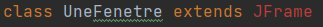

>et la classe UnMobile hérite de JPannel : 

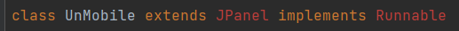

>Ainsi, les propriété de la JFrame sont utilisés pour coder la classe UneFenetre et créer une interface graphique : 

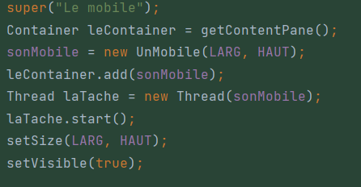

>Tout d'abord un container de contenu de la fenetre où tous les composants sont ajoutés est crée, 
pour le quel on crée un Mobile avec largeur et hauteur. Le mobile est ensuite ajouté au container et au Thread nouvellement crée.
Il nous reste plus qu'à démarrer le Thread et le rendre visible graphiquement.

>Il faut savoir qu'un Thread est une unité d'exécution faisant partie d'un programme et qui fonctionne parrallèlement aux autres unités et de manière totalement autonome.
Ainsi, chaque thread a son propre environnement d’éxécution et sa pile et est unique car est caractérisé par son environnement, état(actif,en attente...) et son nom.

>Cependant, "Runnable" est une interface qui permet en quelque sortes de définir des tâches exécutables par ces mêmes threads.

>2. Ensuite le but de l'exercice était de faire repartir le mobile dans le sens inverse une fois qu'il touche le bord de la fenetre.

>Pour s'y faire il fallait modifier le methode run() utilisée pour le comportement du thread de la classe Mobile en ajoutant une boucle : 

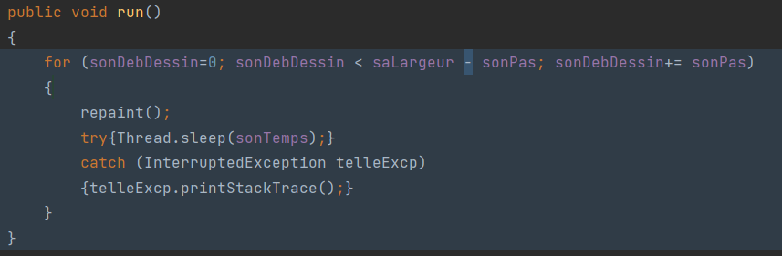

>Ainsi, la méthode run() étant une méthode de l'interface runnable, elle sera appelé lorsque le thread démarre.
Parallèlement, la méthode repaint() sera appelée à chaque itération de la boucle for, elle servira à communiquer avec le composant graphique et lui dire de se redessiner. Elle va donc mettre à jour l'affichage du mobile ( appel indirect de paintComponent() ).
Thread.sleep() dans ce contexte sert uniquement à introduire un délai entre chaque repaint d'un thread ce qui crée le mouvement graphiquement.

### Exercice 2 : 

>Cet exercice consitais à ajouter un bouton à la dernière fenêtre de l'exercice I (mais a été négligé sous la demande de M.Dufaud). Ce bouton devait arrêter ou relancer le mobile en utilisant 
les méthodes suspend() et resume() de la classe Thread.

>Les méthodes suspend() et resume() sont utilisées pour contrôler l'exécution d'un thread. De ce fait comme les noms l'indiquent
la méthode suspend() arrête temporairement le thread en le mettant en pause (un des états possibles d'un thread), d'un autre côté la méthode resume() est employé pour reprendre l'éxécution d'un thread qui est actuellement sous la méthode suspend() et donc en attente.

### Exercice 3 :

>Le but de l'exercice 3 était de modifier le code de l'exercice II de façon à afficher 2 mobiles,pour chaque bouton et chaque zone
d'affichage sont disposés sur une grille de 2 lignes et 2 colonnes.

>Ainsi, l'exercice 3 a été codé de cette manière en modifiant la classe UneFenetre: 

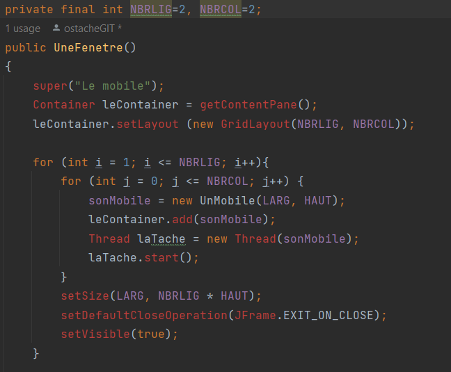

>On introduit simplement une boucle imbriquée pour symboliser les lignes et les colonnes de notre future fenetre, puis pour chaque ligne et colonne on crée un mobile et le thread pour ce mobile en les mettant en marche.

### Exercice 4 (Bonus après le TP2):

_Enoncé:_ 
1) Implementation des semaphores pour les mobiles de la manière :
- on a plusieurs mobiles et plusieurs colonnes 
- quand les mobiles arrivent au bout de la colonnes ils sont stoppé et dans le wait
- un seul d'eux peut passer à la fois
et pareil pour le retour.

2) Ensuite, il faut implémenter un systeme qui genere un nombre random pour le pas du mobile (sonPas),
pour ensuite avoir un liste de mobiles avec des vitesses différentes.

>Le code a été implémenté de la manière suivante : 

>Un sémaphore a été crée dans les champs de la classe UnMobile :

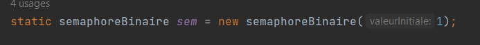

>La méthode run() a été modifié a son tour en utilisant le sémaphore : 

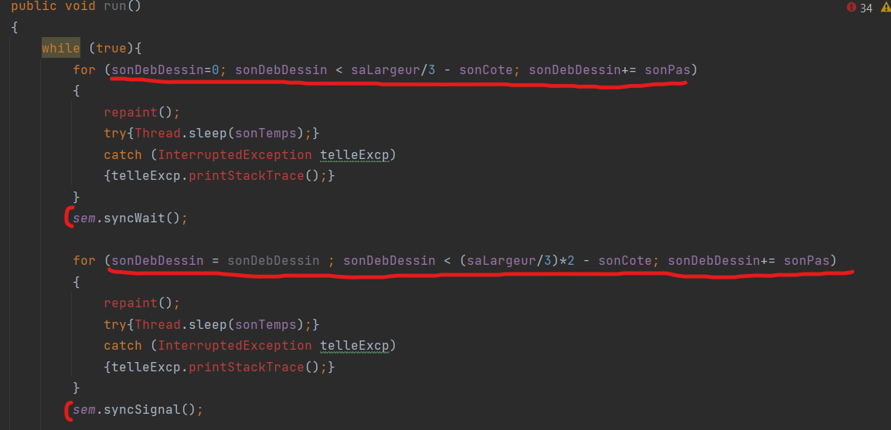

>Les 3 premières boucles représentent le mouvement en avant de la 1ère,2ème et 3èmme colonne, ensuite les 3 dernières boucles for représentent le mouvement du retour des mobiles de la même manière.

>Ce qu'on comprend c'est que chaque colonne de ces mouvement représente les "ressources critiques". 

_définition :
Une ressource critique est une ressource utilisable par un seul processus en place._

>La 2ème colonne et la 5ème représentent la "section critique" de la méthode run() car ces boucles sont entourées de sem.syncWait(); et sem.syncSignal();.

_définition: 
Une section critique est un espace dans le code dédié où un seul processus(thread) peut entrer à la fois. Cela permet une meilleure gestion de processus._

- _le .syncWait() permet d'aquérir un sémaphore en tentant de décrementér sa valeur si >0._
- _le .syncSignal() permet de libérer un sémaphore en tentant d'incrémenter sa valeur._

>Ainsi, l'exclusion mutuelle est un concept clé de ce fonctionnement.

_définition: 
L'exclusion mutuelle est définie par l'accès à une ressource critique d'un processus P1 en excluant un autre processus P2 et réciproquement._

> Dans notre cas, on repère ici ce qu'on appelle aussi un verrou MUTEX, car dans l'exercice un seul mobile peut entrer dans la colonne suivante et les autres sont en attente. Un autre mobile peut entrer seulement si le précédent a déjà parcouru la colonne. Si plusieurs mobiles sont bloqué en attente il va y'en avoir forcément un qui va commencer le parcours une fois qui celui qui s'éxécute sort de la colonne.

## TP2 : Affichage / Semaphores

#### Exercice 1 : 

_Enoncé :_

- _Un seul semaphore pour tout les affichages_
- _Il faut identifier la section critique (par exemple une boucle)_
- _Enfin introduire les syncWait et syncSignal autour de la section critique_
- _Utilisation des classes "Affichage" , "Main" , "semaphore" ,"semaphoreBinaire"_

_Définition : 
Un sémaphore est une méthode qui permet de restreindre l'accès à des ressources dans un environnement de programmation et donc de syncroniser les processus._

_Semaphore binaire :
on herite de semaphore de syncwait et syncsignal et on reecrit signal, mais on laisse wait intact_

>D'après l'énoncé, l'objectif de cet exercice est de faire en sorte que les messages "AAA" et "BB" soient affichés de cette manière, 
soit "AABB" soit "BBAAA", mais jamais mélangés comme par exemple "ABABA".

>Ici, la classe Affichage possède une méthode run() qui est notre section critique ne recevant qu'un seul processus à la fois avec un délai entre chaque qui a été définit : 
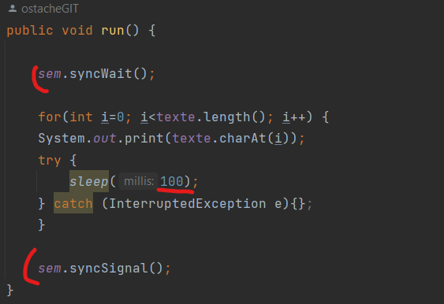
pour mieux tester on peut biensur ajouter des lignes autour de la boucle comme :
>- ′′j’entre en section critique′′
>- ′′je sors de section critique′′
>
>(Exercice 2)

>Cependant le code de la classe semaphore et semaphoreBinaire nous  a été donné par M.Dufaud car il y avait un problème dans le fonctionnement.
La seule chose qui nous a été donné à l'implémentation était donc la méthode Main qui ressemble à ca : 

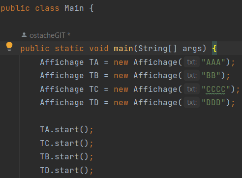

>Graçe aux instances on voit que les tâches vont être éxecutés dans l'ordre TA > TC > TB > TD.

>Ensuite le sémaphore binaire va être utilisé pour l'exclusion mutuelle des processus, car chaque instance va rentre tour à tour dans la boucle de la classe affichage car cette boucle est un section critique.

>Ainsi chaque instance (TA etc...) appelle sem.syncWait(); entre dans la section critique, s'execute et appelle sem.syncSignal(); pour libérer le sémaphore.

## TP3 : Consommateur / Producteur 

_Enoncé :
Cet exercice cherche à simuler la gestion d'une boîte à lettres (BAL). Une tâche, "le producteur"
crée une lettre et dépose celle-ci dans la BAL. Parallèlement, une autre tâche consulte la BAL de
façon asynchrone et retire la "lettre" qu'elle contient puis l'affiche à l'écran; les deux tâches
s'ignorant complètement._

>Le diagramme UML pour ce TP est disponible dans ostap.prog.avancee/uml

>Ainsi, on doit implémenter ce qu'on a déjà vu dans les autres TP dans cet exercice :
le fonctionnement :
>- le producteur ne dépose sa "lettre" dans la BAL que si elle est vide.
>- le consommateur ne retire une "lettre" de la BAL que si elle en contient une.

>Donc, un seul processus peut être actif dans le moniteur (classe ou on peut écrire et lire les lettres, ici c'est BAL), les autres sont bloqués tant qu'un processus est actif.
Ainsi, producteur crée un processus et le donne à moniteur (BAL est donc la classe de la quelle il hérite).
Puis, moniteur(BAL) est consulté par consommateur.
Enfin consommateur récupère le processus et le termine.

>Plusieurs concepts sont donc évoqués ici : 
>- L'exclusion mutuelle (définie précédement)
>- Synchronisation : qui permet de coordonner l'accès à la boite aux lettres entre les producteurs et les consommateurs (2 threads au total : 1 pour les consommateurs et 1 pour le producteurs)
>- Notion de blocking queue : est un concept de file d'attente qui ici permettera de gérer toute l'exécution.

>Dans notre code les classes Producteur et Consommateur possèdent toutes les deux des méthodes run(). Producteur parcourt un alphabet et dépose les lettres grâce à la méthode deposer() de la classe BAL: 

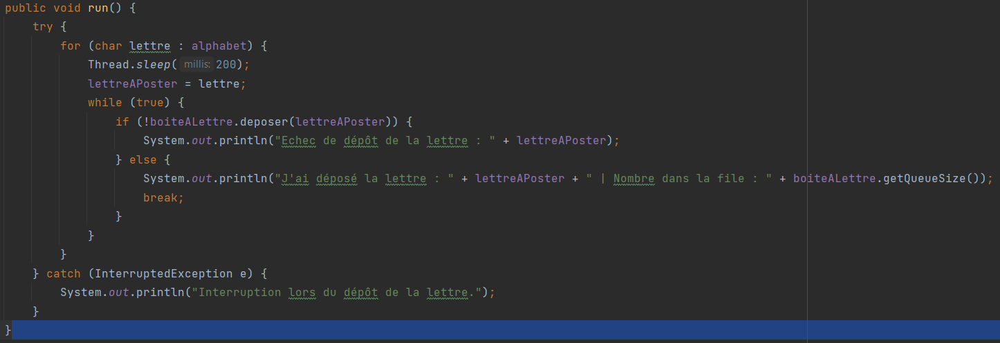

>et Consommateur possède une boucle infinie pour retirer les lettres de la BAL : 

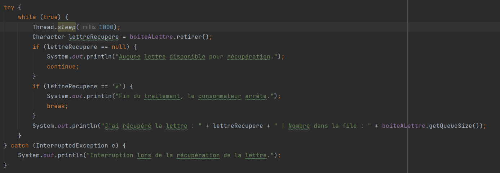

> La blocking queue elle se trouve dans la classe BAL. Ainsi la classe Boulangerie est un wrap de la classe BlockingQueue (notions de offer et poll). Donc la véritable classe derrière est la classe BlockingQueue, avec les notion de offer() et poll().
> La méthode poll() permet de récupérer et de supprimer l'élément le plus haut (tête) d'une file d'attente.
> La méthode offer() permet d'insèrer l'élément spécifié dans cette file d'attente s'il est possible de le faire immédiatement.