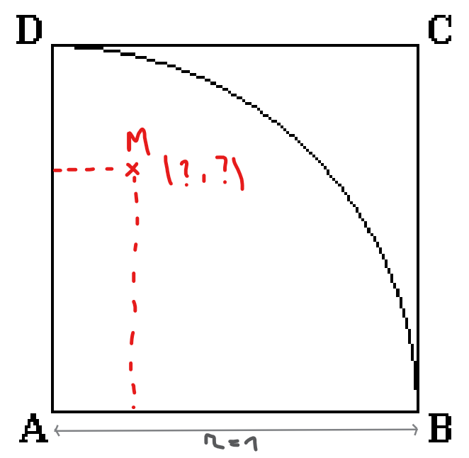
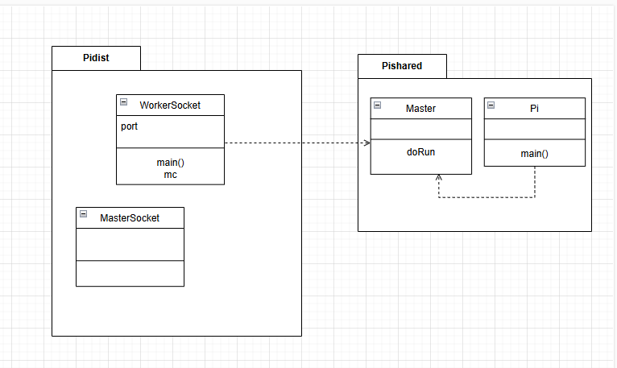
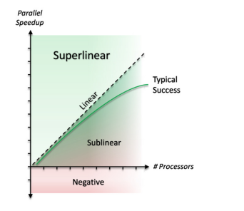

# Programmation Parallèle à mémoire partagée

## Introduction

---

Le travail effectué dans ce rapport a pour but de présenter les différentes étapes de la programmation parallèle à mémoire partagée.
Plus présicésement nous allons aborder la méthode de Monte Carlo (MC) pour calculer π en dans le cadre des architectures à mémoire partagée et distribuée.
Dans ce contexte nous allons présenter les sujets tels que variantes parallèles (itération parallèle, master/slave), l’algorithme séquentiel, leur fonctionnement (notamment dans le code)

 Ce Rapport a été en partie rédigé par ChatGPT, dans le but de le rendre le plus clair et concis possible.

## I. Monte Carlo et calcul de π

---

### Méthode de Monte-Carlo

**Définition :**
C'est une méthode algorithmique visant à calculer une valeur numérique approchée en utilisant des procédés aléatoires, c'est-à-dire des techniques probabilistes

#### Estimation de π
- Soit un point *M* de coordonnées *(x, y)*, où *(0 < x < 1)* et *(0 < y < 1)*. 
- On choisit *x* et *y* au hasard entre *0* et *1* (suivant une loi uniforme).

Le point M appartient au disque de centre *(0,0)* de rayon *R = 1* si et seulement si *x² + y² ≤ 1*.

La probabilité que le point *M* appartienne au disque est *π/4*

Puisque le quart de disque est de surface *σ = πR²/4 = π/4*, et le carré qui le contient est de surface *S = R² = 1* : si la loi de probabilité du tirage de point est uniforme, la probabilité de tomber dans le quart de disque vaut *σ/S = π/4*.


Ainsi, en faisant le rapport du nombre de points dans le disque au nombre de tirages, on obtient une approximation du nombre *π/4* si le nombre de tirages est grand.

Ainsi plus le nombre de tirages est grand, plus l'approximation de *π* est précise.

Pour illustrer cela nous donne quelquechose comme ça :


 


## II. Parallélisation & Programmation Avancée

---

Dans ce second rapport, le sujet abordé est la parallélisation en particulier la parallelisation de l'algorithme de Monte Carlo pour le calcul de π.
Ainsi, nous allons expliquer ce que c'est la parrallélisation, et ces concepts (Master/Worker, Threads et Processus ... ). 

### **Définitions :**
La parallélisation est une technique utilisée en informatique pour exécuter simultanément plusieurs tâches ou calculs sur différents processeurs ou cœurs d'un même processeur. 
Le but est donc de séparer, calculer et combiner les résultats de manière efficace.
L'objectif est d'améliorer les performances et de réduire le temps d'exécution d'un programme en exploitant les capacités de calcul parallèle de la machine.

Le modèle Master-Worker est une architecture de programmation parallèle et distribuée qui divise le travail d'une machine entre deux types de processus : 
un maître et plusieurs travailleurs. 

Ce modèle est particulièrement utile pour les tâches qui peuvent être décomposées en sous-tâches indépendantes.

Ainsi, on a :
  1. Master (Maître) :
      - Le maître est responsable de la coordination globale.
      - Il divise la tâche en sous-tâches et distribue aux travailleurs.
      - Il collecte les résultats des travailleurs, et fais une combinaison ( + synchronisation & communication).
  2. Workers (Travailleurs) :
      - Exécutent les sous-tâches assignées par le maître.
      - Chacun travaille indépendament (sauf syncronisation).
      - Renvoient les résultats au maître.


### Exemple de Parallélisation : le cas de Monte Carlo

Dans le cas de Monte Carlo, et la formule qu'on a vu précédemment, on obtient ce code : 

```java
public class MonteCarlo {
    public static void main(String[] args) {
        int n = 1000000; // Nombre de points
        int count = 0; // Nombre de points dans le quart de disque

        for (int i = 0; i < n; i++) {
            double x = Math.random();
            double y = Math.random();
            if (x * x + y * y <= 1) {
                count++;
            }
        }

        double pi = 4.0 * count / n;
        System.out.println(pi);
    }
}
```

Suivant le cours de notre professeur, on peut paralléliser ce code en utilisant le modèle Master-Worker, en divisant le travail en sous-tâches indépendantes.
Ici, on a deux tâches principales :
  - T1 : Calculer le nombre de points total.
  - T2 : La boucle "for" qui calcule le nombre de points dans le quart de disque.
  
*(Il ya un ordre de taches car la T1 doit être fini avant de commencer T2)*

Ainsi, on constate que la T1 peut être executé en parrallèle, de même T2 peut être executé en parrallèle mais il faut une gestion d'accès à la variable qui s'incrémente (T2 = section critique).

#### Algo parallèle de Monte Carlo

```java
public class MonteCarlo {
  public static void main(String[] args) throws InterruptedException, ExecutionException {
    int n_tot = 1000000;
    int numThreads = Runtime.getRuntime().availableProcessors();
    int pointsPerThread = n_tot / numThreads;

    ExecutorService executor = Executors.newFixedThreadPool(numThreads);
    Future<Integer>[] results = new Future[numThreads];

    for (int i = 0; i < numThreads; i++) {
      results[i] = executor.submit(() -> {
        int count = 0;
        for (int j = 0; j < pointsPerThread; j++) {
          double x = Math.random(), y = Math.random();
          if (x * x + y * y < 1) count++;
        }
        return count;
      });
    }

    int n_cible = 0;
    for (Future<Integer> result : results) {
      n_cible += result.get();
    }

    executor.shutdown();

    double pi = 4.0 * n_cible / n_tot;
    System.out.println(pi);
  }
}
```

Les changements concernent donc :
- La création d'un ExecutorService pour gérer les threads.
- La création de plusieurs tâches (workers) qui calculent le nombre de points dans le quart de disque.
- La somme des résultats des tâches pour obtenir le nombre total de points dans le quart de disque.
- la boucle "for" qui est desormais parrallélisée.
- La division du nombre de points par le nombre de threads pour obtenir le nombre de points par thread.

Ainsi, l'itération parallèle désigne un processus où plusieurs itérations d'une boucle ou plusieurs opérations sont exécutées simultanément, plutôt que de manière séquentielle. Cela peut être appliqué en programmation pour améliorer l'efficacité et la vitesse d'exécution

Cependant sous le modèle Master-Worker, on obtiens quelque chose de plus structuré : 

```java
public class MonteCarloMasterWorker {
    public static void main(String[] args) throws InterruptedException, ExecutionException {
        int n_tot = 1000000; // Nombre total de points
        int numWorkers = Runtime.getRuntime().availableProcessors(); // Nombre de travailleurs
        int pointsPerWorker = n_tot / numWorkers;

        ExecutorService executor = Executors.newFixedThreadPool(numWorkers);
        Future<Integer>[] results = new Future[numWorkers];

        // Le maître distribue les tâches aux travailleurs
        for (int i = 0; i < numWorkers; i++) {
            results[i] = executor.submit(new PiWorker(pointsPerWorker));
        }

        int n_cible = 0;
        // Le maître agrège les résultats des travailleurs
        for (Future<Integer> result : results) {
            n_cible += result.get();
        }

        executor.shutdown();

        double pi = 4.0 * n_cible / n_tot;
        System.out.println("Estimation de π : " + pi);
    }
}

class PiWorker implements Callable<Integer> {
    private final int points;

    public PiWorker(int points) {
        this.points = points;
    }

    @Override
    public Integer call() {
        int count = 0;
        for (int i = 0; i < points; i++) {
            double x = Math.random();
            double y = Math.random();
            if (x * x + y * y < 1) {
                count++;
            }
        }
        return count;
    }
}
```

Ainsi, le modèle Master-Worker permet de tirer parti des capacités de calcul parallèle pour estimer
π de manière efficace. Il permet une bonne scalabilité car permet d'exploiter plusieurs cœurs de processeur ou plusieurs machines pour accélérer le traitement, il est sumple a concevoir la plus part du temps, et a une bonne répartition de charges.

*Remarque :*
On comprend donc très rapidement que chaque code comprend 2 phases principales que ce soit dans l'environnement parallèle ou distribué :
- Phase de calcul : Exécution des opérations et traitements nécessaires.
- Phase d'échange de données : Communication et transfert des résultats entre les différentes entités du système.

Ainsi, L’efficacité d’un programme parallèle dépend de la gestion de ces deux phases. Un bon équilibre entre temps de calcul et temps d’échange est essentiel pour obtenir les meilleures performances possibles.


## III. Analyse des méthodes d'implémentation de Monte Carlo

---

Nous allons maintenant examiner les différentes implémentations de la méthode de Monte Carlo pour le calcul de π (notamment vu en cours).

L'Analyse nous permettra d’analyser la structure de chaque code ainsi que leur approche en matière de parallélisation, avantages/limites, et permettera d'établir un contexte.

### Assignment102.java :

Assignment102 utilise l'API Concurrent pour paralléliser les calculs nécessaires à l'estimation de π avec la méthode de Monte Carlo. 

Definition API Concurrent : Une API concurrente est un outil qui permet à un programme d’exécuter plusieurs tâches en même temps, au lieu de les faire une par une. Elle utilise des techniques comme le multithreading ou le parallélisme pour accélérer les traitements. Son but est d’assurer que plusieurs processus peuvent accéder aux mêmes ressources sans créer d’erreurs ou de conflits.

Voici les points principaux analysés :

**Classes :**
   - PiMonteCarlo : contient l'algorithme principal pour estimer , en exploitant un modèle parallèle avec un pool de threads.

   - Assignment102 : gère l’exécution des expériences, mesure les performances et écrit les résultats dans un fichier.

1. Classe PiMonteCarlo :
   - Utilise un compteur atomique (`AtomicInteger nAtomSuccess`) pour éviter les problèmes d’accès concurrent.
   - Définit une tâche MonteCarlo, qui génère des points aléatoires et incrémente `nAtomSuccess` si le point tombe dans le cercle.
   - Utilise ExecutorService pour créer un pool de threads (`FixedThreadPool`), qui exécute nThrows tâches en parallèle.
   - Calcule π après la fin de toutes les tâches avec la formule : `4 * nAtomSuccess.get() / nThrows`.


2. Classe Assignment102 :
   - Définit différentes valeurs de nombre de threads (`nThreadsList` : 1 à 6) et nombre total de simulations. 
   - Mesure le temps d’exécution pour 1 thread et utilise cette valeur comme référence pour calculer l’accélération (`speedup`). 
   - Écrit les résultats dans un fichier `pi_scalability.txt`.


**Modèles et Threads :** 

Le code suit un modèle d’itération **parallèle**, où plusieurs tâches indépendantes sont exécutées simultanément. Chaque tâche représente un tirage aléatoire et est traitée par un thread distinct.

Le code suit également `ExecutorService` avec `FixedThreadPool`, ce qui permet de :
  - Limiter le nombre de threads simultanés pour éviter une surcharge CPU.
  - Répartir uniformément les tâches entre les threads actifs.

**Limites :** 

Bien que `AtomicInteger` évite les problèmes de concurrence, il peut induire une surcharge liée à la synchronisation des accès mémoire. Une alternative pourrait être l’usage de réductions locales avant une fusion globale des résultats 
(+ `Executors.newWorkStealingPool()` pour une meilleure gestion des tâches dynamiques).

### Pi.java :

**Classes :**
-  Pi : point d'entrée principal du programme, configurant les paramètres d'exécution.
- Master : gère l'exécution des expérimentations, la répartition des tâches, et l'écriture des résultats dans un fichier.
- Worker : chaque worker (ou tâche) exécute une portion du calcul en parallèle.

1. Classe Pi :
   - Configure les tests de scalabilité (faible ou forte) en ajustant le nombre de travailleurs et le nombre total de points.
   - Appelle la méthode `runExperiments` de la classe `Master`.

2. Classe Worker :
   - Implémente `Callable<Long>`, chaque worker effectue des calculs pour une portion des points. Il vérifie si un point est à l'intérieur du cercle et retourne le nombre de "hits".

3. Classe Master :
   - Gère l'exécution parallèle, répartit les tâches entre les workers et calcule Pi.
   - Enregistre les résultats dans un fichier, calcule le temps d'exécution, le speedup et l'erreur relative par rapport à Pi.
   - Implémente `Future<Long>`, gére la synchronisation entre les différents Workers. 

**Modèles :**
Ainsi, Pi.java repose sur l'utilisation des Futures et des Callables pour paralléliser le calcul de π (+ Monte Carlo).

Future : Représente un résultat de calcul asynchrone. Il permet de récupérer le résultat d'une tâche via `get()`, qui bloque jusqu'à ce que la tâche soit terminée.

Callable : Interface pour définir des tâches parallèles qui renvoient un résultat via la méthode `call()`.

Le code suit le modèle Master/Worker. Le Master crée des Workers pour effectuer les calculs de Monte Carlo, et il regroupe les résultats pour le résultat final.

**Limites :**
Blocage avec get() : 
- Peut ralentir si trop de tâches sont en attente.
- Gestion des erreurs : Les exceptions dans les Callable doivent être gérées explicitement.
- Surcharge de threads : Trop de threads peut nuire aux performances.
- Scalabilité limitée : Les gains de performance peuvent stagner avec un trop grand nombre de threads.

Peut-être amélioré avec des `ThreadPoolExecutor` ou `CompletableFuture` pour une gestion plus avancée des tâches et des résultats.

### MasterSocket.java :

**Classes :**
- MasterSocket : point d'entrée principal du programme, gère la communication avec les workers, l'envoi des tâches et la collecte des résultats.
- WorkerSocket : chaque worker écoute sur un port spécifique, effectue les calculs et renvoie les résultats au Master via des sockets.

1. Classe MasterSocket :
   - Initialise la communication avec plusieurs workers via des sockets TCP/IP.
   - Envoie le nombre total de points à chaque worker.
   - Collecte les résultats partiels et calcule l'estimation finale de π.
   - Gère l'exécution parallèle et calcule le temps d'exécution, l'erreur relative et le speedup.
2. Classe WorkerSocket :
   - Écoute les demandes de calcul de π sur un port spécifique.
   - Effectue le calcul de Monte Carlo pour une portion des points et renvoie les résultats au Master via un socket.
   - Arrête l'exécution lorsque le message "END" est reçu.

**Modèles :**
Le programme utilise le modèle Master/Worker, où le MasterSocket répartit les tâches de calcul entre plusieurs WorkerSocket via des sockets réseau. Les workers effectuent les calculs en parallèle et renvoient leurs résultats au Master.

Le Socket : Permet la communication réseau entre le MasterSocket et les workers. Chaque worker ouvre un socket pour recevoir des données et renvoyer les résultats.




**Limites :**
   - Connexion réseau : Dépend de la vitesse et de la stabilité entre le Master et les workers.
   - Gestion des erreurs : Les erreurs réseau et les déconnexions ne sont pas gérées.
   - Scalabilité : Limitée par les ressources réseau et les connexions simultanées.
   - Surcharge du Master : Le Master peut devenir un goulot d'étranglement avec trop de workers.


## IV. Qualité de Développement et Normes ISO

---

La qualité de développement et la conformité aux normes ISO sont essentielles pour garantir des logiciels fiables et performants. Cette section explore comment les normes ISO influencent les pratiques de développement, de test et de gestion de projet, contribuant ainsi à la création de logiciels robustes et évolutifs. Nous examinerons les défis et opportunités liés à la mise en œuvre de ces normes, et leur impact sur la maintenabilité et la sécurité des systèmes.

### Modèles de Qualité et Développement

*Exemple de principales modèles ISO :*

**Quality in Use Model :**
Le Quality in Use Model évalue la qualité logicielle du point de vue de l'utilisateur final. Il se concentre sur l'efficacité, l'efficience, la satisfaction, la sécurité et la liberté par rapport aux risques lors de l'utilisation du logiciel. Ce modèle met l'accent sur l'expérience utilisateur et la réponse aux besoins dans des conditions réelles.

*Accent sur l'expérience utilisateur et réponse au besoin du logiciel : Efficacité, Efficience, Satisfaction, Sécurité, Liberté par rapport aux risques*

**System/Software Product Quality :**
Le System/Software Product Quality évalue les caractéristiques internes et externes du logiciel. Il couvre des aspects tels que la fonctionnalité, la performance, la compatibilité, l'usabilité, la fiabilité, la sécurité, la maintenabilité et la portabilité. Ce modèle est utilisé par les développeurs et les testeurs pour assurer la qualité technique du logiciel avant sa livraison.

*Accent sur des aspects tels que la fonctionnalité, la performance, la compatibilité, l'usabilité, la fiabilité, la sécurité, la maintenabilité et la portabilité*

### Normes ISO et Qualité de Développement

*Exemple de normes ISO :*

**ISO/IEC 9126 (1991) :** Cette norme pionnière sur la qualité logicielle introduit six critères fondamentaux :

**Fonctionnalité :** Capacité du logiciel à fournir les fonctions attendues.
**Efficacité :** Utilisation optimale des ressources par le logiciel.
**Fiabilité :** Stabilité et prévisibilité du logiciel dans diverses conditions.
**Facilité d’utilisation :** Simplicité et intuitivité de l'interface utilisateur.
**Maintenabilité :** Facilité à modifier et à mettre à jour le logiciel.
**Portabilité :** Capacité du logiciel à être transféré d'un environnement à un autre.

**ISO/IEC 25010 (2011) :** Cette norme succède à l'ISO 9126 et enrichit les dimensions de la qualité logicielle en intégrant la sécurité et la compatibilité.

**ISO/IEC 25041 :** Ce guide méthodologique propose une approche structurée pour évaluer la qualité logicielle en quatre étapes :

- **Définir les exigences de qualité :** Identifier les besoins spécifiques en matière de qualité.
- **Élaborer un modèle de qualité :** Créer une structure pour évaluer ces besoins.
- **Appliquer des métriques normalisées :** Utiliser des mesures quantitatives conformes à l'ISO/IEC 25002.
- **Évaluer et améliorer en continu :** Analyser et optimiser le logiciel de manière itérative.


## V. Évaluations et tests de performances

---

Cette partie du rapport est consacrée à l'évaluation des performances des différentes implémentations de Monte Carlo pour le calcul de π.
Dans cette partie on va notamment expliquer les résultat des différentes implémentations, les tests de scalabilité, et les performances en fonction du nombre de threads ou de workers etc.

Mon approche consiste en deux scripts Python dédiés à tester la scalabilité faible et forte d'une implémentation du calcul de π. Ces scripts récupèrent les résultats d'exécution, enregistrés dans un fichier `pi_scalability.txt`, où chaque implémentation écrit ses performances (temps d'exécution, approximation de π, etc.).


### Scalabilité ? : 

#### Scalabilité forte : 

Definition : La scalabilité forte fait référence à la capacité d'un système à maintenir ses performances (ou à réduire ses temps d'exécution) lorsqu'on augmente le nombre de ressources (comme des threads ou des workers) tout en maintenant constant la taille du problème à résoudre.
Elle est évalué grâce à son speedup : `speedup = T1 / Tn`, où T1 est le temps d'exécution avec un seul thread ou worker, et Tn est le temps d'exécution avec n threads ou workers.

Le speedup (accélération) est une mesure de l'amélioration des performances d'un système lorsque le nombre de ressources (comme des processeurs, des threads ou des workers) augmente. Il compare le temps d'exécution d'une tâche avec un nombre de ressources à celui avec un nombre de ressources plus élevé.

Un speedup idéal est linéaire, c'est-à-dire que le temps d'exécution diminue proportionnellement au nombre de ressources ajoutées. Cependant, dans la pratique, le speedup peut être affecté par des facteurs tels que la communication entre les ressources, les dépendances de données, les ressources partagées, etc.



#### Scalabilité faible :

Definition : La scalabilité faible fait référence à la capacité d'un système à maintenir ses performances (ou à réduire ses temps d'exécution) lorsqu'on augmente le nombre de ressources (comme des threads ou des workers) et la taille du problème à résoudre proportionnellement.

Son speedup est calculé de la même manière que pour la scalabilité forte, mais avec une exception, c'est-à-dire que  la taille du problème augmente avec le nombre de
processus il faut donc se poser la question : "Est-ce que mon code me permet de traiter des problèmes plus
gros grace à l’augmentation du nombre de processus ?"

Dans le cadre de la scalabilité faible on double le nombre de flèches/points avec l'augmentation de Threads/processeurs.


### Résultats des tests de scalabilité Assignment102 :

Pour évaluer la scalabilité de l'implémentation Assignment102, le code a été modifié sous la demande du professeur pour permettre de fixer le nombre de processeurs utilisés via l'initialisation de la classe PiMonteCarlo.

**Résultats des tests de scalabilité forte :**


Les résultats se présentent sous la forme suivante :
- Total de Workers (ou Threads) utilisés est de 6
- Chaque worker est utilisé 10 fois par le système pour le calcul de pi
- Une moyenne est faite sur 10 tests pour chaque nombre de processeurs

L'analyse des résultats montre que le speedup commence à 1, puis baisse avant de stagner sous 1. 
En effet, cette diminution de performance peut s'expliquer par plusieurs facteurs :

- AtomicInteger intorduit une latence, ralentissant les threads à mesure que leur nombre augmente.
- La gestion des threads devient coûteuse lorsque le nombre de cœurs dépasse un certain seuil.

Cela montre que l'implémentation Assignment102 atteint ses limites en termes de scalabilité forte, et que l'ajout de plus de threads ne permet pas d'améliorer les performances. Ce n'est donc pas efficace.

**Résultats des tests de scalabilité faible :**


Les résultats se présentent sous la forme suivante :
- Total de Workers (ou Threads) utilisés est de 6
- Chaque worker est utilisé 10 fois par le système pour le calcul de pi
- Une moyenne est faite sur 10 tests pour chaque nombre de processeurs
- Le nombre de points initial est de **16000000**
- Le nombre de points est doublé à chaque test

L'analyse des résultats montre que le speedup commence à 1,
Cependant on voit une baisse très significative du speedup à partir de 1 processeur, ce qui indique que l'implémentation Assignment102 n'est pas efficace pour la scalabilité faible non plus, ça montre également que Assignment102 n'est vraiment pas efficace quand le problème augmente.
L'ajout de processus a un impact quasi-inexistant sur la performance du programme. Par conséquent, doubler le nombre de points entraîne logiquement un temps d'exécution deux fois plus long.


### Résultats des tests de scalabilité Pi.java :

**Résultats des tests de scalabilité forte :**


Les résultats se présentent sous la forme suivante :
- Total de Workers (ou Threads) utilisés est de 12
- Chaque worker est utilisé 10 fois par le système pour le calcul de pi
- Une moyenne est faite sur 10 tests pour chaque nombre de processeurs
- Le nombre de points initial est de **12000000** et **120000000** (donc 2 courbes différentes)

Ainsi, la courbe suit une trajectoire linéaire jusqu'au nombre 3 de threads, ensuite plus ou moins linéaire sur une large plage de points, cependant il y a des legeres deviation plus on se raproche du nombre 12. Malgré cela, le speedup reste croissant, ce qui témoigne d'une parallélisation  plustôt efficace.

**Résultats des tests de scalabilité faible :**


Les résultats se présentent sous la forme suivante :
- Total de Workers (ou Threads) utilisés est de 12
- Chaque worker est utilisé 10 fois par le système pour le calcul de pi
- Une moyenne est faite sur 10 tests pour chaque nombre de processeurs
- Le nombre de points initial est de **16000000**
- Le nombre de points est doublé à chaque test

Pour un faible nombre de processus (1 à 4), le speedup est proche de 1, ce qui indique une bonne scalabilité faible.

À mesure que le nombre de processus augmente au-delà de 4, le speedup commence à diminuer, indiquant que l'efficacité du système diminue.

À 12 processus, le speedup est significativement inférieur à 1, ce qui montre que l'ajout de plus de processus ne contribue pas efficacement à la résolution du problème plus grand.
Cependant ça reste plus efficace que Assignment102.

### Résultats des tests de scalabilité MasterSocket.java :

**Résultats des tests de scalabilité forte :**


Les résultats se présentent sous la forme suivante :
- Total de Workers (ou Threads) utilisés est de 6 (des Sockets)
- Chaque worker est utilisé 8 fois par le système pour le calcul de pi
- Une moyenne est faite sur 8 tests pour chaque nombre de processeurs
- Le nombre de points initial est de **12000000** et **120000000** (donc 2 courbes différentes)

Pour les deux configurations (ntot = 120,000,000 et ntot = 1,200,000,000), le speedup augmente de manière presque linéaire avec le nombre de processus jusqu'à environ 4 processus.

Au-delà de 4 processus, le speedup commence à diverger de la ligne de scalabilité idéale, indiquant une diminution de l'efficacité.

À 6 processus, le speedup est encore supérieur à 1, mais il est inférieur à la scalabilité idéale, montrant que l'ajout de plus de processus ne contribue pas proportionnellement à l'amélioration de la performance.

**Résultats des tests de scalabilité faible :**


Les résultats se présentent sous la forme suivante :
- Total de Workers (ou Threads) utilisés est de 6
- Chaque worker est utilisé 8 fois par le système pour le calcul de pi
- Une moyenne est faite sur 8 tests pour chaque nombre de processeurs
- Le nombre de points initial est de **12000000**
- Le nombre de points est doublé à chaque test

Le speedup reste très proche de 1 pour tous les nombres de processus testés (de 1 à 6). Cela signifie que le système maintient une efficacité constante lorsque le nombre de processus augmente, ce qui est un bon indicateur de scalabilité faible.
Il y a une légère diminution du speedup à mesure que le nombre de processus augmente, mais cette diminution est minime.

Le système réagit donc bien quand la taille du problème augmente.


## VII. Ce code répond-il aux spécifications ?

---

### Scalabilité Forte : 
Dans le cas de la scalabilité forte (nombre total de points constant), nous avons observé les comportements suivants :

**Assignment102 :**
- Comme établi précédemment, Assignment102 a une scalabilité forte très mauvaise. Elle reste constamment proche de 1 et n'augmente pas, indiquant une incapacité à tirer parti de l'augmentation des ressources pour améliorer les performances.

**Pi.java :**
- Pi.java présente la meilleure scalabilité forte parmi les trois codes. Le speedup est quasi-idéal, suivant de près la courbe théorique et s'améliorant avec un plus grand nombre de points. Cela montre une efficacité dans l'utilisation des ressources supplémentaires pour réduire le temps d'exécution.

**MW Socket :**

- L'implémentation MW en Socket est un cas particulièrement intéressant. Elle montre une scalabilité forte similaire à Assignment102 avec peu de points, mais s'améliore et se rapproche de Pi.java avec un plus grand nombre de points. En résumé, bien que Pi.java ait la meilleure scalabilité forte sur tous les nombres de points, MW Socket semble s'améliorer avec un plus grand nombre de points, suggérant qu'elle pourrait éventuellement dépasser Pi.java avec un nombre suffisant de points.

### Scalabilité Faible
Pour la scalabilité faible (nombre de points par worker constant), les résultats sont les suivants :

**Assignment102 :**

- Là encore, Assignment102 montre une scalabilité faible très mauvaise. Le speedup est divisé par 2 à chaque fois que le nombre de points par worker est multiplié par 2, indiquant une quasi-inutilité de l'ajout de workers supplémentaires. Cela montre une inefficacité à gérer des problèmes de plus grande taille.

**Pi.java :**

- Pi.java a une scalabilité faible correcte, bien que le speedup diminue de manière significative avec l'augmentation du nombre de workers. De plus, avec 1,000,000 de points, le speedup de Pi.java dépasse la barre des 1.0, ce qui est conforme aux données mais reste difficile à expliquer.

**MW Socket :**

- L'implémentation MW en Socket a la meilleure scalabilité faible parmi les trois codes. Bien que le speedup de Pi.java soit supérieur en dessous de 16 workers pour 1,000,000 et 10,000,000 de points, MW Socket finit toujours par repasser au-dessus. À 100,000,000 de points, le speedup de Pi.java est complètement inférieur à celui de MW Socket. Cela montre que MW Socket a un avantage, bien que son efficacité décroisse avec l'augmentation des ressources, comme pour Pi.java.

### Limites et Recommandations
**Assignment102 :**

- Limites : Très mauvaise scalabilité, à la fois forte et faible. Impossibilité d'exécuter des tests avec un nombre important de points par worker, probablement dû à une gestion inefficace de la mémoire.
- Recommandations : Revoir complètement la structure de ce code. Il serait pertinent d'implémenter une meilleure gestion des tâches et des communications entre workers. Tester d'autres approches algorithmiques pour améliorer l'utilisation des ressources.

**Pi.java :**

- Limites : Scalabilité faible qui baisse avec le nombre croissant de workers. Algorithme efficace mais qui ne fonctionne qu'en mémoire partagée, difficile donc à porter sur d'autres infrastructures.
- Recommandations : Limiter l'utilisation de cette implémentation à des scénarios de mémoire partagée pour éviter les contraintes liées à la distribution.

**MW Socket :**

- Limites : Bien que la scalabilité faible soit la meilleure, elle diminue tout de même significativement avec l'augmentation du nombre de workers. L'implémentation par sockets peut engendrer une surcharge de communication, surtout avec un grand nombre de workers.
- Recommandations : Optimiser la gestion des communications entre les workers pour réduire les surcharges liées aux sockets. Utiliser cette implémentation pour des cas nécessitant une mémoire distribuée et où la charge peut être suffisamment répartie.

En guise de conclusion, MW Socket est l'implémentation préférable pour des scénarios à mémoire distribuée, Pi.java est préférable pour une mémoire partagée uniquement, tandis qu'Assignment102 n'est pas viable pour une utilisation pratique.


## PARTIE PRISE DE NOTES /!\ à ne pas prendre en compte

## INTRO

Cours + Méthode code séquentiel vers un code en parallèle

Un paradigme def : voir rapport.md

Aspects : SIMD ou MIMD (voir cours)

### COURS + M2THODE

(2 classes distingués Parallélisme de tâche & données)

Méthode parallelisation :
- Analyse de l'algo (but : trouver des taches donc boucles, parties du codes à parrallèliser).

Parallélisme de tâche :
- Decoupe tâche en plusieurs sous-tâches
- Identifier les variables partagées entre les (sous-)tâches 
- Associer tâche à un processus (support d’exéc)

(cas d'utilisation = tache car scénario)

REMARQUE CODE :
chaque code = 2 phases principales : 
- phase de calcul
- phase d'échange de données

+ code de steve kaultz à voir

### Assignement 102

API concurrent où n_cible <=> nAtomSuccess

tache monte carlo = une iteration        
(ici : chaque tache MC => thread associé)
(ici : algo avec vole de tache car + adapté)
Algo des iterations parallèle

## PI

Dans le code de PI : 
- pas de biblio math : arraylist er random (util)
- 
- Classe pi :
    - Contient une méthode main.
    - main instancie un obj Master (classe) et exécute  doRun.
- Classe Master :
    - de la méthode main de pi.
    - méthode principale : doRun.
- Responsabilités de doRun :
    - calcule un total (total count).
    - gére le nombre de workers (numWorkers).
    - enregistre le temps de début de l'exécution (start time).
    - Crée une liste de tâches (tasks).
    - Chaque tâche = un worker.
- Les Workers :
    - chaq worker = un callable.
    - callable implémente Runnable.
    - retourne une valeur calculée.
- Résultats :
    - liste d'objets Future avec les résultats des tâches exécutées par les workers.
- Executor :
Utilise un algorithme d'exécution avancé :
Gestion du vol de tâches (Work Stealing).
Ordonnancement des tâches, etc.

## 13/12

code monte carlo + diagramme de classe

concept Atomic (atomic integer) : operation pour incrementer une section critiqu.
moniteur = atomic et donc objet qui protege un int avec points d'entrer (incrementAndGet).

### speedup

tc(temps calcul) theorique different a chaque fois

T1 = ntot * ti
T2 = ntot/2 * ti + (tc2)
Tp = ntot/p * ti + (tcp)
Sp = T1/Tp  = (ntot*ti) / (ntot/p * ti) + (tc)
(temps d'exec)

( scalabilité forte  zone negative = je ralentis )

Tp > T1
Sp < 1
ntot/2 + 3/4 * ntot

(si on met dans le petit zone 1/4 donc remplace 3/4 par 1/4 alors Tp<T1 Sp > 1)

### Consignes tp 13/12: 

1) Executer et passer les parametres à l'éxécutable (A102 : ntot et nb processor);
   Pi : ntot/p et p = nbworker):
      - assignment102
      - PI 
2) Avoir les mêmes sorties pour les 2 codes.
- err relative (|PI - pi|) / pi
- ntot, nb processus, tps            + printf("err ntot np tps", append); (sortie dans un fichier)
3) Speedup "grossier" (voir comportement en gros)

### 17/01

prog parallele et distribué 
concurrence 
archi memoire partagé
(Java thread, MC avec API Concurrent) modele et paradigme de pro parallele 


mémoire distribué 
java socket 

Master (it worker,num worker) ---MasterWorker ---> Master calcul de pi
Master (it worker,num worker) ---itworker ---> Wo
Wo ---n_cibles---> Master (it worker,num worker)
Master (it worker,num worker) ------> Wn-1
Wn-1 ---n-=_cibles_n-1--> Master (it worker,num worker)


Envois de message : 
Master : client 
Worker : serviteur

* Master envoie N message contenant le nombre d'itération  (1 à Tous)
* Chaque Wk envoie n_ciblek (Tous à 1)

En JAVA : 
En cours Client/Serveur   (tous/1)

serveur send à client
serveur recieve de client 
client send à serveur
serveur recieve de client


### 27/01 

Exo : faire 10 tests par process 

### 29/01

exo: tracer le courbe de sclabilité forte et faible en python

### 31/01 

1) Validation MC avec Javasocket 
2) Conception Integrer Pi.java dans WorkerSocket 
 - diagramme de classe 
 - graphe de tâches 


3) Validation
4) Scalabilité sur 1 poste 
5) Mise en oeuvre sur N postes

### 10/02